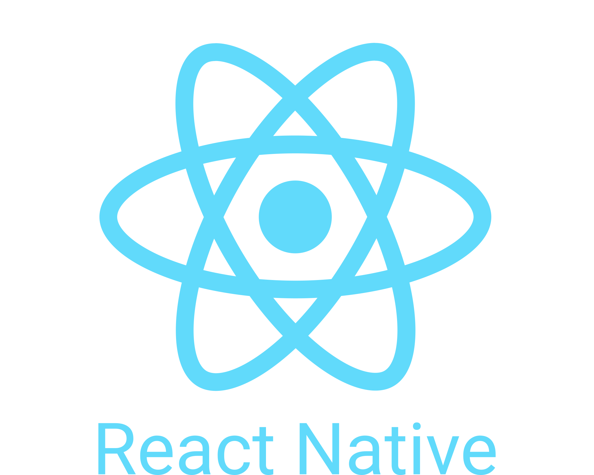
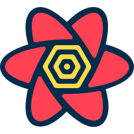
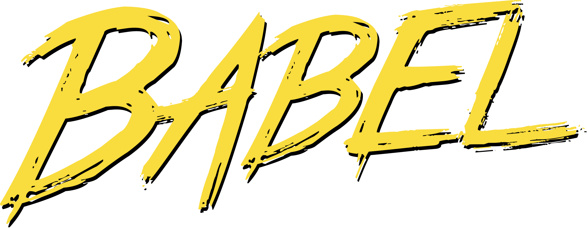
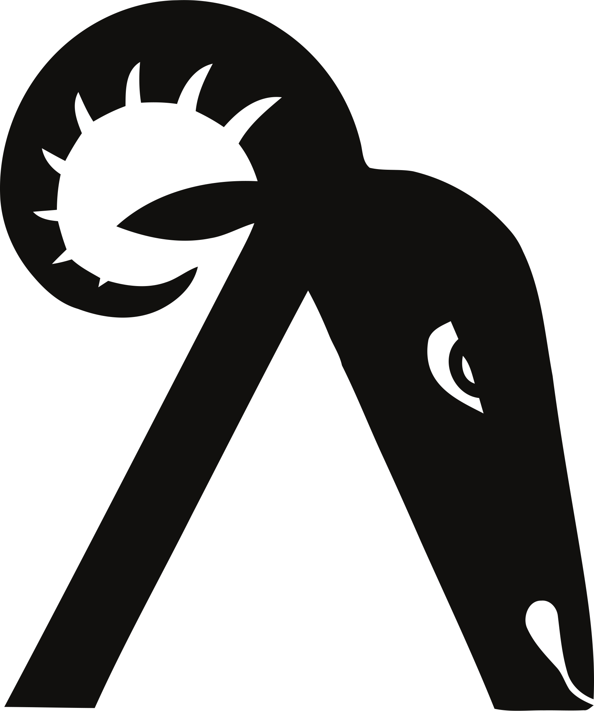

### Hi there 

My name is Abdallah Abusamrah, I'm a lifelong learner who enjoys learning new things and keeps improving. .

Since middle school , I've always been fascinated by computers & loved spending hours playing on them! I'm currently working as a Frontend developer & Trainer for young Software Engineers.👨‍💻🖥

My dream is to impact the world forever with my creations.🌎

 
 

💡 I'm currently learning Redux!

🤝 I'm looking to connect with more Software Engineers!

🔥 My passions: Tech, coding, crypto, hiking, reading, & food!

 
 

📫 Reach me at: abdallahabusamrah98@gmail.com
 
👤 LinkedIn profile: www.linkedin.com/in/abdallah-abusamrah

 
 

### 🔨 Languages and Tools:   

 

  

 
 
 
 
 
 
 
 
 

